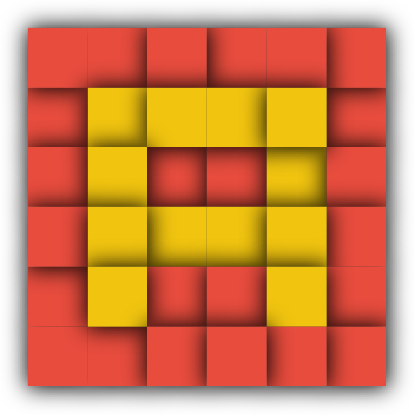
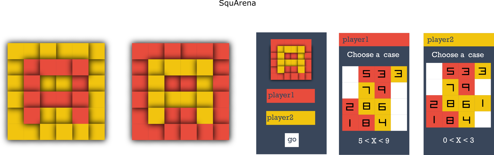
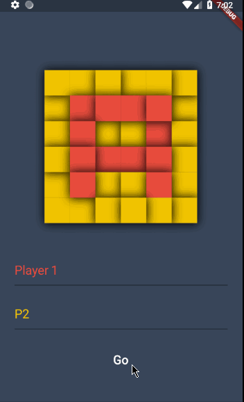

# SquArena
2 players will fight in this tactical and turn based game ⬜⬛

(Mockup I made before starting the dev)

## How to play?
Each turn, a player will have two random numbers.
Then, he can touch a square, a random value between the 2 numbers will appears.
If it's next to a square of the other player and if the value is bigger, it will catch it.
Let's take as many squares as possible !

## What does it use?
  - Flutter

## Why this project ?
Interested in mobile cross-platform dev, I wanted to try the google's solution with a first project, this one.

## To do
- [X] UI
- [X] gameplay
- [ ] pop up that tell who's the winner

## Can I help you?
Of course ! By trying to do the tasks of the todo section, by giving advices or by hitting the :star: button !
